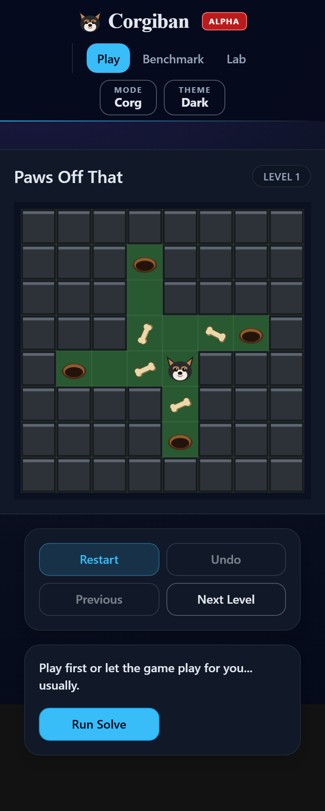
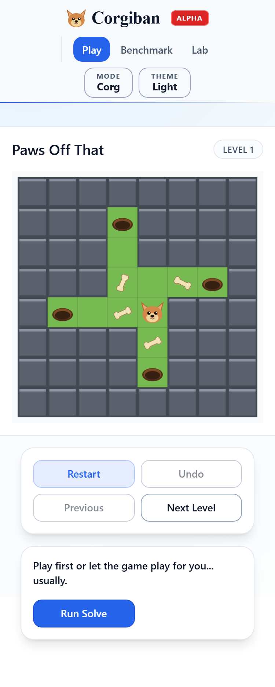
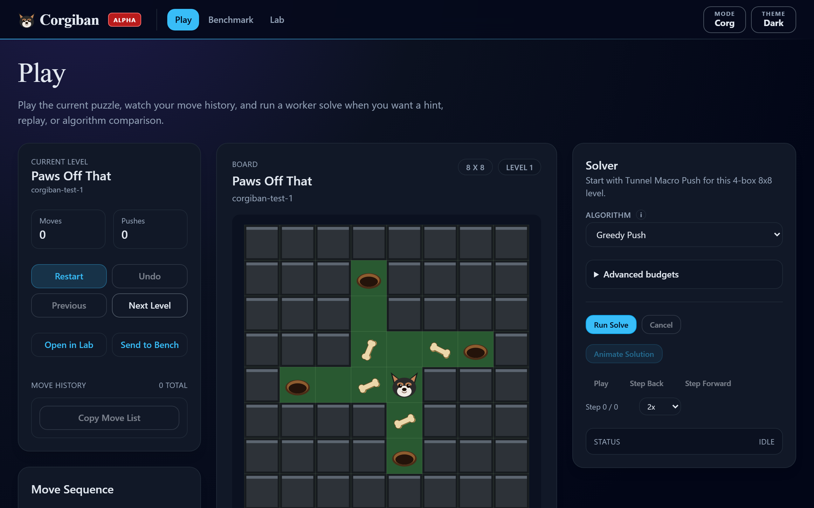
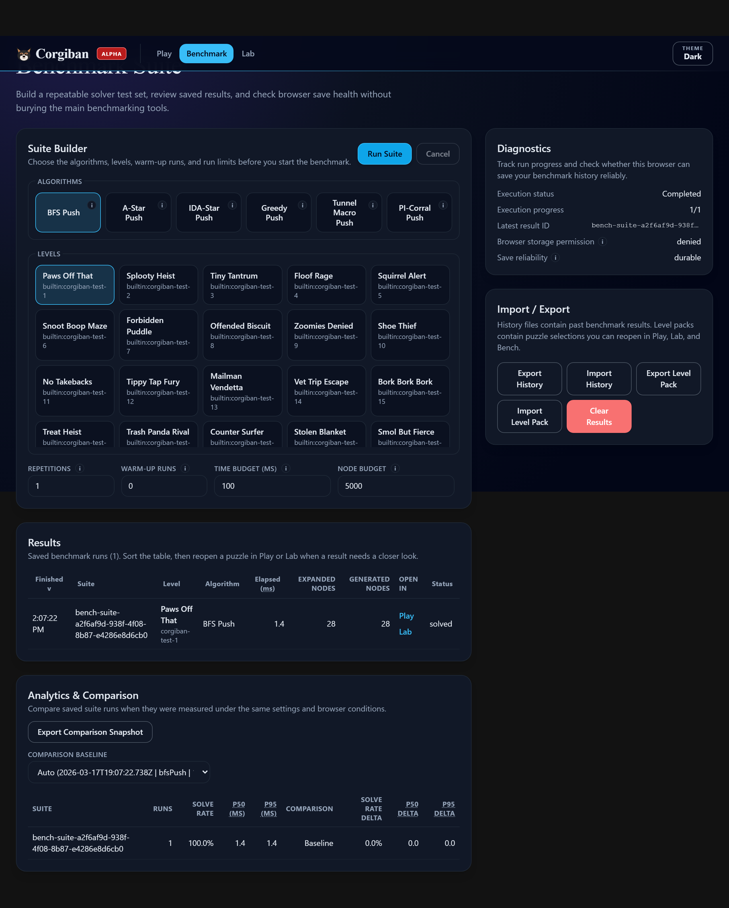

# Corgiban

A Sokoban-style puzzle game built as a self-contained proof of concept. The architecture splits
a deterministic core engine, multiple solver algorithms, and worker-backed benchmark flows into
framework-agnostic workspace packages, then assembles them behind a Remix web app with dedicated
routes for gameplay, level authoring, and benchmarking.

The repository is public so the architecture, decisions, and tradeoffs are visible. It should be
read as a finished proof of concept - forks are welcome, but active maintenance and PR review
are not guaranteed.

For deployment and forking guidance, see [docs/cloudflare-pages-deployment.md](docs/cloudflare-pages-deployment.md).
For licensing, see [LICENSE](LICENSE).

## Screens

<table>
  <tr>
    <td></td>
    <td></td>
  </tr>
  <tr>
    <td colspan="2"><em><code>/play</code> mobile - board-first gameplay with solver assistance, in dark and light themes.</em></td>
  </tr>
</table>


_`/play` desktop - side panel with controls, sequence input, and solver algorithm selection._


_`/bench` - repeatable benchmark suites, persisted history, and comparison-oriented analysis._


_`/lab` - authoring flow for parsing, previewing, validating, and handing levels off to Play or Bench._

## What this demonstrates

- A deterministic Sokoban engine and solver domain split into framework-agnostic packages
- Web Worker isolation for all solver and benchmark execution - keeps the main thread
  responsive with real-time progress, cancellation, and replay support
  - Six solver algorithms: BFS, A\*, IDA\*, Greedy, Tunnel Macro, and PI-Corral
- A versioned, Zod-validated Worker message protocol so the UI and compute layers communicate
  through a strict contract instead of ad-hoc postMessage calls
- A Remix + React + Tailwind + Redux Toolkit app shell with mobile-aware canvas gameplay
- Browser-side benchmark workflows that run entirely in Workers, with persistence, analytics,
  import/export, and stable public comparison identity
- Route specialization (`/play`, `/lab`, `/bench`) instead of collapsing every tool into one page
- Cloudflare Pages deployment handled through an adapter-friendly app structure

## Quickstart

```bash
pnpm i
pnpm dev
```

Playwright setup (once per machine):

```bash
pnpm exec playwright install chromium
```

Regenerate the README screenshots from the production preview:

```bash
pnpm build
pnpm -C apps/web preview:cloudflare
# in another terminal
pnpm screenshots:readme
```

Production-style preview through the Cloudflare Pages adapter:

```bash
pnpm -C apps/web preview
```

### Validation

```bash
pnpm typecheck
pnpm lint
pnpm format:check
pnpm style:check
pnpm test
pnpm test:coverage
pnpm test:smoke
pnpm encoding:check
pnpm levels:rank
pnpm best-practices
pnpm exec depcruise --config dependency-cruiser.config.mjs packages/ apps/
```

## Repo layout

```text
apps/
  web/                 Remix + Vite frontend (Play, Lab, Bench routes)
packages/
  shared/              Cross-cutting types and utilities
  levels/              Level schema and builtin level catalog
  formats/             Level format parsers (SLC XML, etc.)
  core/                Deterministic game engine - no DOM, no framework
  solver/              BFS, A*, IDA*, Greedy, Tunnel Macro, PI-Corral
  solver-kernels/      Low-level search primitives shared across solvers
  worker/              Web Worker protocol, client, and runtime
  benchmarks/          Benchmark schema, comparison, and report types
  embed/               Embeddable widget entry point
tools/                 Dev scripts, reporters, and analysis utilities
docs/                  Architecture, ADRs, and project plan
```

## Tooling and governance

- `LLM_GUIDE.md` - collaboration and quality policy
- `docs/security-guidance.md` - lint-enforced security rules and trust-boundary guidance
- `docs/Architecture.md` - boundaries, worker protocol, and package responsibilities
- `docs/project-plan.md` - phased roadmap and proof notes
- `docs/dev-tools-spec.md` - tooling expectations and reporting contracts
- `KNOWN_ISSUES.md` - generated tracker dashboard
- `.tracker/issues/*.md` - local source of truth for deferred and fixed work

GitHub issues are disabled. Bugs and deferred cleanup are tracked locally, then surfaced
through `KNOWN_ISSUES.md` via `pnpm issue:generate` / `pnpm issue:check`.

## Future directions for forks

- Solver optimization and advanced search tuning
- More polished visuals, sprite work, and motion design
- Alternate level catalogs or pack workflows
- Browser-dev tooling experiments inside `/lab`
- Different benchmark reporting or persistence strategies
